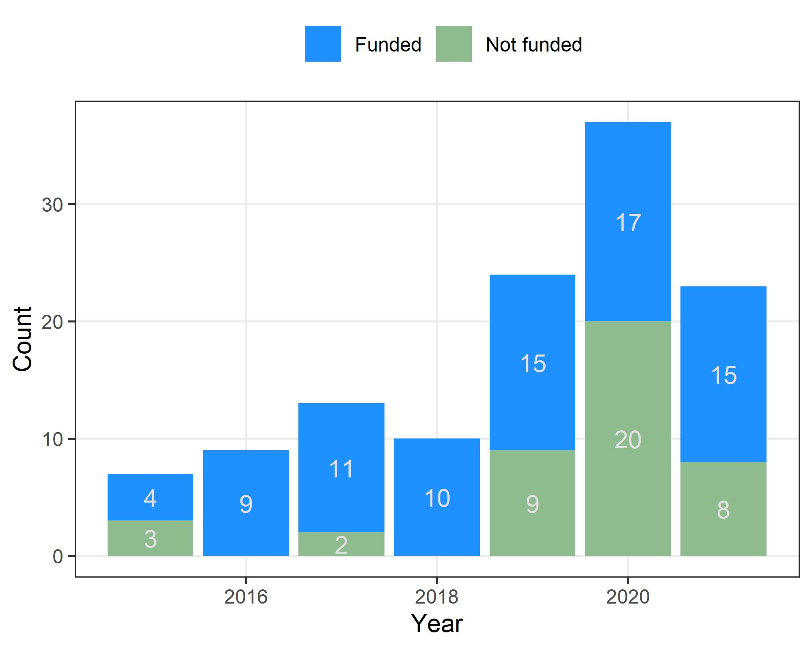
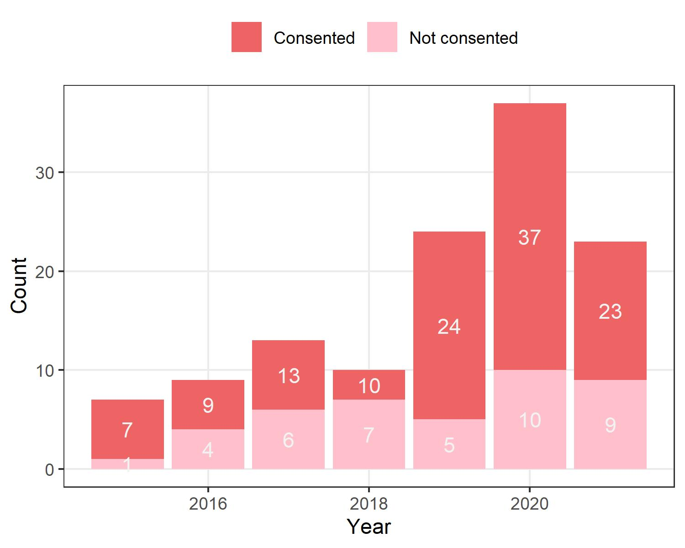
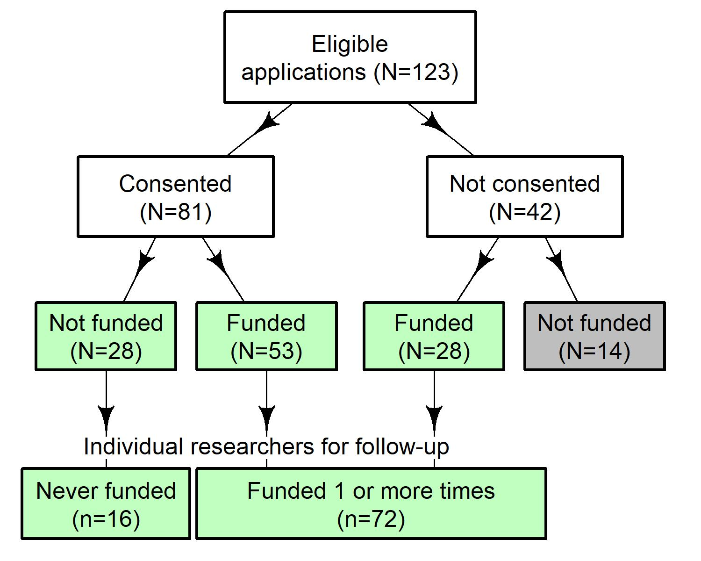

```{r setup, include=FALSE}
# using formatting in Word document (see above)
knitr::opts_chunk$set(echo = FALSE, warning=FALSE, message=FALSE, error=FALSE, comment='', dpi=400)
options(width=1000) # Wide pages
options(scipen=999) # avoid scientific presentation
source('99_functions.R')
library(dplyr)
library(tidyr)
library(ggplot2)
library(janitor) # for tables with column totals
library(stringr)
library(flextable)

# randomisation groups
load('data/0_researchers_randomised.RData')
randomised = researchers # rename
# data from research assistant
load('data/1_researchers_post_ra.RData')

# get the publication data, from # 2_publication_data_[database].R
source('4_get_data.R')
# create combined data of papers
papers = bind_rows(papers_scholar, papers_scopus, papers_researchgate, .id='database')
```

In this document we give summary statistics and graphs that describe the sample of researchers.

# Applications

## Numbers funded and not funded over time

```{r}
# from 0_annual_numbers_diagram.R

```

There were 2 years where all applicants who made it through the peer review were funded.

## Numbers who consented and did not consent over time

```{r}

```

## Repeated applications

Here we show the pattern of repeated applications. The table shows the number of attempts and the combinations in time order.

```{r}
for_table = select(randomised, number, year, result) %>%
  arrange(number, year) %>%
  group_by(number) %>%
  mutate(attempt = 1:n()) %>%
  select(-year) %>%
  pivot_wider(names_from = attempt, values_from = result) %>%
  unite('overall', c(`1`,`2`,`3`,`4`), sep=', ', na.rm=TRUE) %>%
  group_by(overall) %>%
  tally() %>%
  mutate(attempts = str_count(overall, pattern=', ') + 1) %>%
  arrange(attempts)
ftab = select(for_table, attempts, overall, n) %>%
  flextable() %>%
  autofit() %>%
  theme_box() %>%
  merge_v(j=1)
ftab
```

## CONSORT flow chart

```{r}

```

# Difference between those who consented and did not

Here we examine if there was a difference between those who consented and those who did not. We do this by comparing those who did not consent but were funded (for whom data is publicly available) to those who did consent. The only group missing are those who did not consent but were not funded. As funding was at random, this missing group should be the same as those who did not consent but were funded. 

We used a multivariate model with the three dependent variables of the number of papers in _Google Scholar_, _Scopus_ and _researchgate_. We log-transformed these counts and used a multivariate normal distribution. The model included a binary variable for whether the researcher consented or not, and a random intercept for each researcher to control for repeated data from the same researchers over time. We modelled any remaining correlation in counts using the variance--covariance matrix of the multivariate normal. We assumed the effect of consent was the same on a log-scale for all three databases and each database had its own intercept. The model is defined using equations below.

$$\log(\textrm{count})_{i,1:3} \sim MVN(\mu_{i,1:3}, \Sigma_{1:3,1:3}), \quad i = 1,\ldots,N,$$
$$\mu_{i,1} = \alpha_1 + \beta \times \textrm{consent}_i + \gamma_{r(i)}, $$
$$\mu_{i,2} = \alpha_2 + \beta \times \textrm{consent}_i + \gamma_{r(i)}, $$
$$\mu_{i,3} =\alpha_3 + \beta \times \textrm{consent}_i + \gamma_{r(i)}, $$
$$\gamma_k \sim N(0,\sigma^2),\quad k=1,\ldots,M,$$
$$\Sigma^{-2}_{1:3} \sim \textrm{Wishart}(3),$$
$$\sigma^{-2} \sim \textrm{Gamma}(0.1, 0.1),$$
$$\alpha_j \sim N(0, 10^4), \quad j=1,2,3,$$
$$\beta \sim N(0, 10^4).$$

where MVN is multivariate normal.

```{r}
outfile = 'results/compare_consent_bayes.RData'
# run model or not
any_model = length(dir('results', pattern='compare_consent_bayes\\.RData'))
if(any_model == 0){
  source('4_compare_consent.R') # run the model in winbugs
}
if(any_model > 0){
  load(outfile)
}
#
nice_table = filter(table, str_detect(parameter, pattern='consent')) %>%
  mutate(Mean = roundz(exp(mean),2), # counts were modelled on log-scale
         lower = roundz(exp(lower),2),
         upper = roundz(exp(upper),2),
         CI = paste(lower, ' to ', upper, sep='')) %>%
  select(parameter, Mean, CI, pvalue)
ftab = flextable(nice_table) %>%
  theme_box() %>%
  autofit()
ftab
```

The table shows the estimate for consent ($\exp(\beta)$ in the model) which is a multiplier of publication counts.
There was an increase in publication counts for those who consented compared with those who did not. Those who consented were hence more experienced than those who did not. 

##### Residual check

The plot below is the histogram of residuals. The residuals were calculated using the log-transformed counts.

```{r}
# plot residuals, they are calculated in 4_compare_consent.R
hplot = ggplot(data=residuals, aes(x=res))+
  geom_histogram()+
  xlab('Residual')+
  ylab('Count')+
  facet_wrap(~database, scales='free')+
  theme_bw()
hplot
```

There are three large residuals for the _researchgate_ database.

## Difference in years of experience

Here we examine a difference in those who consented and not in terms of their years of experience. We used a similar Bayesian model as above but with a single outcome of years of experience.

```{r}
# make year estimates in non-consent and consent group from chains
non_consent = exp(bugs_res_year$sims.matrix[,2]) # alpha
consent = exp(bugs_res_year$sims.matrix[,2] + bugs_res_year$sims.matrix[,1]) # alpha + beta
stats = data.frame(consent = consent, non_consent = non_consent) %>% 
  pivot_longer(cols=everything()) %>%
  group_by(name) %>%
  summarise(mean = mean(value),
            lower = quantile(value, 0.025),
            upper = quantile(value, 0.975)) %>%
  mutate(Mean = roundz(mean,1), # counts were modelled on log-scale
         lower = roundz(lower,1),
         upper = roundz(upper,1),
         CI = paste(lower, ' to ', upper, sep='')) %>%
  select(name, Mean, CI) %>%
  rename('Group' = 'name')
ftab = flextable(stats) %>%
  theme_box() %>%
  autofit()
ftab
#
```

The table shows the estimated years of experience in the groups who consented and did not consent, and the 95% credible intervals for the mean.
The consent group had more years of experience on average.
The Bayesian probability that the groups differ is `r roundz(1-year_table$pvalue[1],2)`.

```{r, include=FALSE}
pilot = FALSE
source('99_mcmc.R')
```

The Bayesian models used `r n.chains` chains with a burn-in of `r format(MCMC*thin, big.mark=',')` followed by a sample of the same size thinned by `r thin`.

# Researchers


## Career start

Here we estimate when researchers' careers start by looking at the date of their first publication. We count publications from any of the three databases.

```{r}
# stats per person:
ystats = group_by(papers, number) %>%
  summarise(First = min(year),
            Last = max(year)) %>%
  pivot_longer(cols=c('First','Last'), values_to = 'year', names_to='Career')
# summary table
stats = group_by(ystats, Career) %>%
  summarise(q1 = round(quantile(year, 0.25)),
            q2 = round(quantile(year, 0.5)),
            q3 = round(quantile(year, 0.75)))
ftab = flextable(stats) %>%
  add_header(Career='', q1='Quartile', q2='Quartile', q3='Quartile') %>%
  merge_h(part='header') %>%
  theme_box() %>%
  colformat_num(j=2:4, digits=0, big.mark='') %>%
  autofit()
ftab
```

#### Histograms of first and last papers

```{r, fig.width=7}
gplot = ggplot(data=ystats, aes(x=year, fill=Career))+
  geom_histogram(col='grey88')+
  scale_fill_manual(NULL, values=c('gold2','olivedrab4'))+
  theme_bw()+
  theme(legend.position = 'none')+
  facet_wrap(~Career, scales='free')
gplot
```

There was a relatively wide range in when the researchers' careers started. 
Most researchers appeared to be still active, as most of the final publications were 2021 or 2022.

## Institutions

```{r}
tab = tabyl(researchers, host) %>%
  arrange(-n) %>%
  janitor::adorn_totals() %>%
  mutate(percent = roundz(percent*100))
ftab = flextable(tab) %>%
  theme_box() %>%
  autofit
ftab
```


# Publications

Here we examine the data on publications downloaded from researchers.

## Database availability

We initially used four databases to gather data on the researchers' publications record: ORCID, Scopus, ResearchGate and Google Scholar. However, it was clear that some researchers were not updating their ORCID page, or had not linked their ORCID page to services that would update it automatically. For some researchers it was difficult to tell if they had or had not updated their ORCID. Hence we excluded this data.

Below we summarise the availability of the three remaining databases using a plot that shows the combinations of available data, with blue signifying the database was available. 

The follow-up dates were `r format(scholar_date, '%d-%b-%Y')` for _Google Scholar_, `r format(scopus_date, '%d-%b-%Y')` for _Scopus_, `r format(researchgate_date, '%d-%b-%Y')` for _researchgate_, and `r format(altmetric_date, '%d-%b-%Y')` for _Altmetric_. 

```{r}
# four databases
#orcid_yes = filter(frame_orcid, works_available == 'Yes') %>%
#  mutate(orcid = TRUE)  %>%
#  select(number, orcid)
scholar_yes = filter(frame_scholar, papers > 0) %>%
  mutate(scholar = TRUE) %>%
  select(number, scholar)
scopus_yes = mutate(frame_scopus, scopus = TRUE) %>%
  select(number, scopus)
researchgate_yes = mutate(frame_researchgate, researchgate = TRUE) %>%
  filter(papers>0) %>%
  mutate(researchgate = TRUE)  %>%
  select(number, researchgate)
# make tile plot
for_tile = full_join(full_join(scholar_yes, scopus_yes, by='number'), researchgate_yes, by='number') %>%
  arrange(number) %>% 
  mutate(pattern = paste(scholar, scopus, researchgate, sep=''))
save(for_tile, file='results/database_availability.RData') # save as used by 4_power_simulation.Rmd
# Check that numbers add up
if(nrow(for_tile) != max(researchers$number)){
  missed = which(1:max(researchers$number) %in% for_tile$number == FALSE)
  cat('Numbers do not agree, missing is researcher number ',missed, '.\n', sep='')
}
   
# prepare data for plot
for_tile = group_by(for_tile, scholar, scopus, researchgate, pattern) %>%
  tally() %>%
  arrange(n) %>%
  ungroup() %>%
  mutate(row = 1:n()) %>%
  select(-pattern) %>%
  pivot_longer(cols = c(scholar, scopus, researchgate))

# plot
x_labels = paste('n = ', filter(for_tile, name=='scholar') %>% pull(n), sep='')
tile = ggplot(data=for_tile, aes(x=row, y=factor(name), fill=value))+
  geom_tile()+
  scale_fill_manual(values='skyblue')+
  coord_flip()+
  xlab('')+
  ylab('')+
  scale_x_continuous(expand=c(0,0), breaks=1:length(x_labels), labels=x_labels)+
  scale_y_discrete(expand=c(0,0))+
  theme(legend.position = 'none',
        text = element_text(size=14))
tile

# for text below
num = max(for_tile$n)
text = filter(for_tile, row == max(row)) %>%
  filter(!is.na(value)) %>%
  pull(name) %>%
  paste(collapse= ' and ')
```

The modal combination was to have all three databases and there were `r num` researchers with this combination. Most of the sample had two or more databases.

The data were downloaded on `r format(scholar_date, '%d-%b-%Y')` for Google Scholar and `r format(scopus_date, '%d-%b-%Y')` for Scopus. 

## Publications over time

Each line in the plot is a researcher.

```{r, fig.width=7}
# combine three databases
labels = c('Google Scholar','Scopus','Researchgate')
papers = group_by(papers, database, number, year) %>%
  tally() %>% # counts per year per researcher per database
  arrange(database, number, year) %>%
  group_by(database, number) %>% # per researcher per database
  mutate(cum = cumsum(n)) %>% # cumulative per person
  ungroup() %>%
  mutate(database = factor(database, levels=1:length(labels), labels=labels))
M = length(unique(papers$number))
colours = grey(runif(M, min=0.2, max=0.8)) # each person gets a different shade
#
gplot = ggplot(data=papers, aes(x=year, y=n, col=factor(number), group=number))+
  geom_line()+
  scale_color_manual(values=colours)+
  ylab('Annual number of publications')+
  xlab('Year')+
  scale_y_log10()+ # +1 to count
  coord_cartesian(xlim = c(1980,2022))+
  theme_bw()+
  theme(legend.position = 'none',
        panel.grid.minor = element_blank()) +
  facet_wrap(~database)
gplot
```

We restrict the time axis from 1980 onwards to avoid squashing most of the data.

#### Summary statistics for the number of publications per year

```{r}
stats = group_by(papers, database) %>%
  summarise(N = n(),
            q1 = quantile(n, 0.25),
            q2 = quantile(n, 0.5),
            q3 = quantile(n, 0.75))
ftab = flextable(stats) %>%
  add_header(database='', N='', q1='Quartile', q2='Quartile', q3='Quartile') %>%
  merge_h(part='header') %>%
  theme_box() %>%
  autofit()
ftab
```

The table above shows the median number of papers per year and 1st to 3rd quartile. The `N` is the total number of person years. Google scholar tends to include more papers.

#### Cumulative publication numbers

```{r, fig.width=7}
gplot_cum = ggplot(data=papers, aes(x=year, y=cum+1, col=factor(number), group=number))+
  geom_line()+
  scale_color_manual(values=colours)+
  ylab('Cumulative number of publications')+
  xlab('Year')+
  scale_y_log10()+ # +1 to count
  coord_cartesian(xlim = c(1980,2022))+
  theme_bw()+
  theme(legend.position = 'none',
        panel.grid.minor = element_blank()) +
  facet_wrap(~database)
gplot_cum
```

We use a cumulative plot as an alternative visualisation of the publication data. The count axis is on a log (base 10) scale.

# Citations

The citation data are from Scopus. The earliest year available is 1990.

### Citations over time

```{r}
# 
M = length(unique(citations$number))
colours = grey(runif(M, min=0.2, max=0.8)) # each person gets a different shade
gplot = ggplot(data=citations, aes(x=year, y=n, col=factor(number), group=number))+
  geom_line()+
  scale_color_manual(values=colours)+
  ylab('Annual number of citations')+
  xlab('Year')+
  scale_y_log10()+ # +1 to count
  coord_cartesian(xlim = c(1990,2022))+
  theme_bw()+
  theme(legend.position = 'none',
        panel.grid.minor = element_blank()) 
gplot
```

The citation data was downloaded on `r format(scopus_date_citations, '%d-%b-%Y')`.

#### Summary statistics for the number of citations per year

```{r}
citations = filter(citations, !is.na(n))
stats = summarise(citations,
            N = n(),
            q1 = quantile(n, 0.25),
            q2 = quantile(n, 0.5),
            q3 = quantile(n, 0.75))
ftab = flextable(stats) %>%
  add_header(N='', q1='Quartile', q2='Quartile', q3='Quartile') %>%
  merge_h(part='header') %>%
  theme_box() %>%
  autofit()
ftab
```

The table above shows the median number of papers per year and 1st to 3rd quartile. The `N` is the total number of person years.

#### Cumulative citations over time

```{r, fig.width=7}
#
citations = group_by(citations, number) %>%
  arrange(number, year) %>%
  mutate(cum = cumsum(n)) %>%
  ungroup()
#
gplot_cum = ggplot(data=citations, aes(x=year, y=cum+1, col=factor(number), group=number))+
  geom_line()+
  scale_color_manual(values=colours)+
  ylab('Cumulative number of citations')+
  xlab('Year')+
  scale_y_log10()+ # +1 to count
  coord_cartesian(xlim = c(1990,2022))+
  theme_bw()+
  theme(legend.position = 'none',
        panel.grid.minor = element_blank())
gplot_cum
```

We use a cumulative plot as an alternative visualisation of the citation data. The count axis is on a log (base 10) scale.

# Altmetric

The Altmetric data was downloaded on `r format(altmetric_date, '%d-%b-%Y')`.

#### Summary statistics for the number of citations per year

```{r}
stats = summarise(altmetric_average,
            N = n(),
            q1 = quantile(n, 0.25), # says n, but is average
            q2 = quantile(n, 0.5),
            q3 = quantile(n, 0.75))
ftab = flextable(stats) %>%
  add_header(N='', q1='Quartile', q2='Quartile', q3='Quartile') %>%
  merge_h(part='header') %>%
  theme_box() %>%
  autofit()
ftab
```


# Employment data

```{r}
load('data/1_researchers_post_ra.RData') # from 1_read_hand_entered.R
tab = janitor::tabyl(researchers$employed) %>%
  arrange(-n) %>%
  adorn_totals() %>%
  mutate(percent = round(percent*100)) 
names(tab)[1] = 'Employed'
ftab = flextable(tab) %>%
  theme_box() %>%
  autofit
ftab
```

Most of the researchers are still employed in a research role.

# Funding data

These data were extracted from ORCID only and it is not clear that these data are well completed as the researchers need to manually add this data.

```{r}
stats = summarise(other_funding, 
                 N = n(),
            q1 = quantile(dollars, 0.25, na.rm=TRUE),
            q2 = quantile(dollars, 0.5, na.rm=TRUE),
            q3 = quantile(dollars, 0.75, na.rm=TRUE))
ftab = flextable(stats) %>%
  add_header(N='', q1='Quartile', q2='Quartile', q3='Quartile') %>%
  merge_h(part='header') %>%
  theme_box() %>%
  autofit()
ftab
```

The table shows the number of researchers with funding information and summary statistics on the number of grants per researcher.

